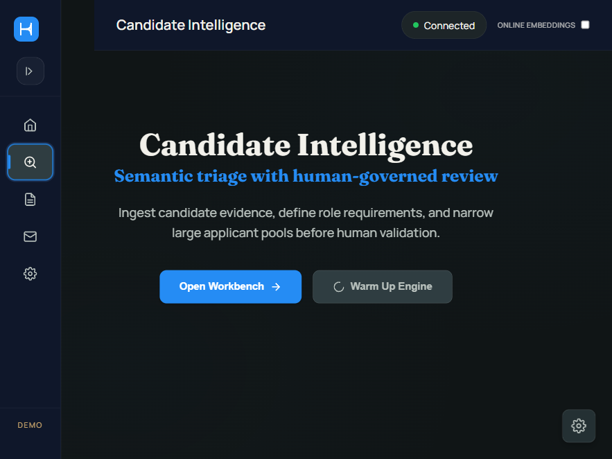
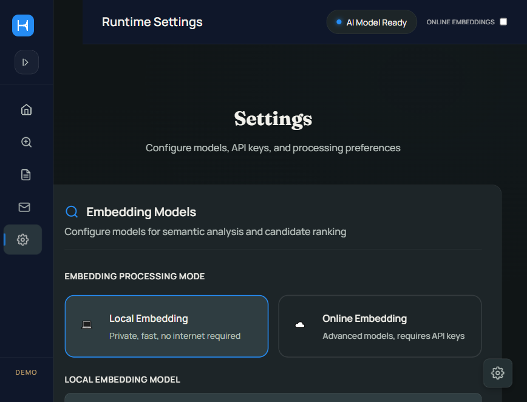
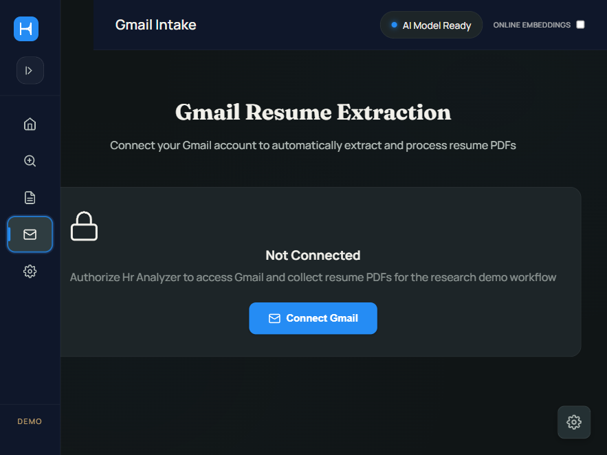

# Hr Analyzer

Hr Analyzer is a research-driven HR screening and interview-support prototype prepared as a polished submission demo for the project report **"Impact_on_HR_Processes_Using_AI_India_Report.pdf"**.

The application is built as a working Node.js + Tauri desktop-ready system that demonstrates how AI can assist HR workflows in:

- resume intake and collection
- parsing and candidate structuring
- semantic search and ranking
- shortlist support and export
- interview script generation
- Gmail-assisted resume retrieval

This repository is intentionally positioned as a **production-style research prototype**. It is meant to feel like a complete working application for demonstration, evaluation, and viva/project-report presentation, while still staying honest about governance limits and human-review requirements.

## Research Context

The bundled report identifies a practical HR pain pattern across manual screening workflows:

- repetitive resume collection from email and mixed sources
- time pressure during first-pass screening
- weak traceability in shortlist decisions
- cognitive load in drafting interview rounds repeatedly

The implemented prototype scope in the report includes:

- automatic resume collection and ingestion
- parsing and embedding generation
- searchable candidate repository
- semantic retrieval and cosine-similarity ranking
- Gmail-based intake for recent resumes
- URL, Excel, and direct-file ingestion pathways
- interview question and script generation
- shortlist export to PDF and Excel

The report also concludes that AI is most useful here when it reduces intake friction and narrows the search space, while **final hiring judgment must remain human-led**.

Relevant report file:

- [Impact_on_HR_Processes_Using_AI_India_Report.pdf](./Impact_on_HR_Processes_Using_AI_India_Report.pdf)

## What This Project Demonstrates

Hr Analyzer is designed to demonstrate the following thesis in a practical, inspectable way:

1. AI can significantly reduce administrative burden in HR intake workflows.
2. Semantic ranking is valuable for triage, not for autonomous final selection.
3. Interview-support generation is one of the most immediately usable AI features for HR teams.
4. Explainability, reviewer discipline, and governance matter as much as raw model output.

## Current Product Scope

The app is organized into five primary surfaces:

### 1. Research Dashboard

- frames the project in research language
- explains what the demo does and does not claim
- highlights workflow evidence and governance themes from the report

### 2. Candidate Intelligence

- ingest + rank new resumes
- rank existing stored candidates against a new role brief
- ingest-only archival flow
- vector reuse / embedding regeneration support
- shortlist export

### 3. Interview Studio

- generate structured interview scripts from job and candidate context
- support technical interview preparation as an AI-assisted drafting workflow

### 4. Gmail Intake

- connect Gmail using Google OAuth
- find recent resume PDFs
- move mailbox-based intake into the same analysis pipeline

### 5. Runtime Settings

- choose local vs online embedding strategy
- configure model providers
- manage reranker options
- configure Gmail OAuth credentials
- tune performance and concurrency settings

## Screenshots

Screens below were captured from the rebuilt desktop-ready release flow used in this repository.

### Candidate Intelligence



### Runtime Settings



### Gmail Intake



## Architecture Summary

The implementation follows the report's high-level architecture closely:

1. **Input connectors**
   - Gmail
   - direct resume files
   - URLs
   - Excel / spreadsheet style ingestion

2. **Parsing layer**
   - resume text extraction
   - normalization
   - contact extraction
   - structured storage

3. **Embedding / vector layer**
   - sqlite-backed storage
   - sqlite-vec retrieval support
   - local or online embedding pipelines

4. **Ranking layer**
   - semantic matching
   - similarity scoring
   - optional reranker stage

5. **AI generation layer**
   - interview script generation

6. **Output layer**
   - shortlist views
   - PDF and Excel export
   - UI-driven review workflows

## Tech Stack

### Application stack

- Node.js / Express
- Socket.IO
- Better SQLite3
- sqlite-vec
- vanilla frontend in `public/`

### AI / processing stack

- Google Gemini
- Cohere
- Jina
- NVIDIA NIM
- Mistral embeddings
- LM Studio local embedding option
- `@huggingface/transformers`
- `onnxruntime-web`

### Desktop packaging

- Tauri 2
- Rust launcher shell
- bundled Node runtime sidecar

## Repository Layout

```text
.
|-- index.js                       # main bootstrap
|-- server.js                      # Express + Socket.IO server
|-- public/                        # frontend UI
|-- src/
|   |-- core/                      # runtime paths, pipelines, embeddings, workers
|   |-- modules/
|   |   |-- analyzer/              # ranking and candidate analysis flows
|   |   |-- gmail-workspace/       # Gmail OAuth and extraction flows
|   |   `-- script-generator/      # interview script generation
|   |-- routes/                    # API route composition
|   `-- workers/                   # background processors
|-- src-tauri/                     # desktop shell
|-- scripts/                       # utilities, sidecar build, demo launch
|-- tests/                         # standalone tests
`-- Impact_on_HR_Processes_Using_AI_India_Report.pdf
```

## Runtime Model

This project is **not local-first**. It is primarily an online, API-backed research demo, although it can optionally use local embedding behavior for some workflows.

Important runtime characteristics:

- internet access is normally required for the strongest demo flows
- API-backed features depend on configured providers and keys
- Gmail intake depends on Google OAuth setup
- local model support is optional, not the default operational assumption

## Data and Storage

At runtime, the project uses writable directories for:

- database storage
- resumes
- temporary uploads
- downloaded or prepared model assets

In desktop mode, writable data is redirected away from the code folder into the application data directory. In repo/dev mode, local writable paths are used inside the project workspace.

Typical runtime artifacts include:

- `analyzer.db`
- `resumes/`
- `temp_uploads/`
- `models/`

## Main Workflows

### Candidate analysis

1. Provide role context or job description
2. Ingest resume sources or reuse stored candidates
3. Parse and normalize content
4. Generate embeddings
5. Rank candidates semantically
6. Optionally rerank
7. Export shortlist

### Interview support

1. Provide role and candidate context
2. Generate an interview script
3. Review and edit before use

### Gmail intake

1. Configure OAuth credentials
2. Connect Gmail
3. Filter recent mailbox results
4. Pull resume PDFs
5. Send them into the same candidate pipeline

## Research-Aligned Interpretation

The report's conclusions map well to the current product behavior:

### Strong operational value

- Gmail and multi-input intake remove administrative friction
- searchable structuring makes candidate pools easier to manage
- semantic ranking reduces large pools into usable top sets
- interview script generation reduces blank-page effort

### Important boundaries

- semantic relevance is not the same as candidate quality
- polished resume language can create false positives
- context, authenticity, and final shortlist judgment still require humans
- governance must be explicit, not assumed

## Governance Position

This demo is intentionally aligned with a human-in-the-loop HR posture.

It should be presented as:

- an AI-assisted screening and preparation tool
- a triage and decision-support system
- a workflow amplifier for HR operations

It should **not** be presented as:

- an autonomous hiring decision engine
- a fairness-certified ranking platform
- a full ATS replacement
- an enterprise compliance-complete HR system

## Recommended Demo Flow for Project Presentation

If you are presenting this project in a viva, review, or submission demo, the cleanest sequence is:

1. Open the **Research Dashboard**
   - explain the study framing
   - highlight scope and governance language

2. Open **Candidate Intelligence**
   - show ingest/rank workflows
   - explain that ranking is for narrowing, not final judgment

3. Show **Interview Studio**
   - position it as a high-acceptance, lower-risk AI support feature

4. Show **Gmail Intake**
   - connect the app to the report's intake automation findings

5. Show **Runtime Settings**
   - discuss model choice, reranking, Gmail configuration, and performance tuning

6. Close with **limitations and future enhancements**
   - explainability
   - authenticity signals
   - reviewer workflow intelligence
   - governance dashboarding

## Setup

### Prerequisites

- Node.js 20+
- npm
- Rust toolchain
- Tauri CLI support
- Windows is the primary environment validated in this repository

### Install dependencies

```bash
npm install
```

### Start the web app / local server

```bash
npm run dev
```

This starts the application server and serves the UI locally.

### Start the app from a clean demo path

```bash
npm run start:from-scratch
```

### Run tests

```bash
npm test
```

### Run Tauri desktop development

```bash
npm run tauri:dev
```

### Build the desktop app

```bash
npm run tauri:build
```

## Desktop Build Outputs

The project currently packages successfully into:

- [Desktop executable](./src-tauri/target/release/hr-analyzer-desktop.exe)
- [MSI installer](./src-tauri/target/release/bundle/msi/Hr%20Analyzer_1.0.0_x64_en-US.msi)
- [NSIS installer](./src-tauri/target/release/bundle/nsis/Hr%20Analyzer_1.0.0_x64-setup.exe)

## Configuration

### Environment variables

The current environment file uses the following server-level keys:

- `PORT`
- `NODE_ENV`
- `AI_MODEL`
- `MAX_WORKERS`
- `MAX_FILE_SIZE`
- `DB_PATH`

### UI-managed settings

Many day-to-day demo settings are controlled from the in-app settings UI instead of hardcoded environment configuration, including:

- embedding provider selection
- local embedding choice
- reranker configuration
- Gmail OAuth client details
- API key entry for supported providers
- performance options and worker concurrency

For demo convenience, some provider credentials are entered through the UI. That is appropriate for a submission prototype, but it should not be confused with enterprise-grade secret-management practice.

## Verification Status

The repository has been validated through:

- standalone Node test execution via `npm test`
- `cargo check` for the Tauri shell
- `npm run tauri:build` for packaged desktop output
- browser-based UI verification of the final layout
- release-build screenshot capture from the packaged app runtime

## Known Limitations

This is a strong submission demo, but it is still honest about its limits.

### Product limitations

- final candidate quality cannot be inferred from resume semantics alone
- Gmail intake requires manual OAuth setup
- API-backed features depend on key availability and connectivity
- the current system is not a full ATS with enterprise workflow integration

### Governance limitations

- explainability can still be improved
- authenticity-risk signaling is not yet fully implemented
- audit and reviewer-overrides dashboarding is still future work
- bias/fairness assurance is not automatically guaranteed by semantic retrieval

### Security / deployment limitations

- provider-key handling is demo-oriented rather than enterprise secret-management grade
- the packaged app is validated as a desktop submission build, not as a hardened corporate deployment image

## Future Enhancements

The report specifically points toward the following next steps:

### Explainability

- top reasons for candidate ranking
- confidence bands
- evidence snippets tied to resume spans

### Authenticity risk signaling

- buzzword-density vs evidence-density heuristics
- chronology inconsistency checks
- generic project-description flags

### Reviewer workflow intelligence

- side-by-side candidate comparison
- reviewer prompts for fit and overqualification
- mandatory rationale capture for major overrides

### Governance dashboarding

- audit-log visibility
- drift and override reporting
- role-level quality summaries

## Positioning Statement for Submission

If you need one concise line for the report/demo:

> Hr Analyzer is a research-backed, production-style HR screening prototype that demonstrates how AI can improve intake, triage, and interview preparation while preserving human control over final hiring judgment.

## License

MIT

## Author

Chun
